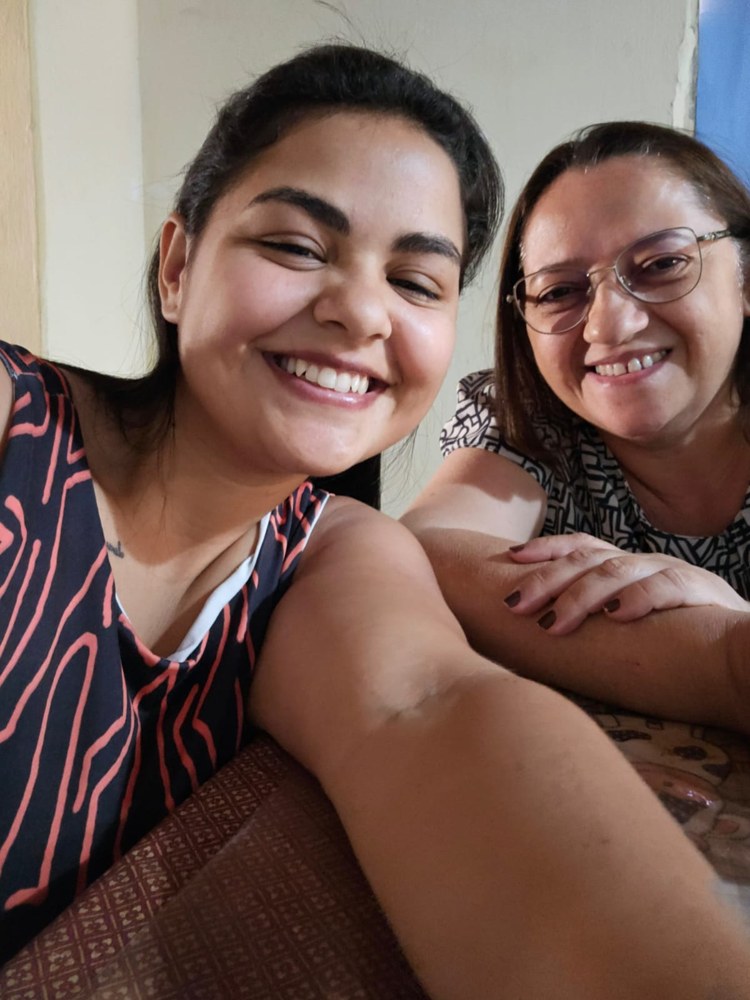

# site-aniversario
Site de aniversário para Eliane
[index.html](https://github.com/user-attachments/files/22628758/index.html)<!DOCTYPE html>
<html lang="pt-BR">
<head>
  <meta charset="UTF-8">
  <meta name="viewport" content="width=device-width, initial-scale=1.0">
  <title>Feliz Aniversário, Meu Amor</title>
  
</head>
<body>
  <header>
    <h1>Feliz Aniversário, Eliane ❤️</h1>
    
Um presente cheio de amor, feito só para você

  </header>

  

    
    
Desde o dia em que nossas vidas se cruzaram, eu descobri o verdadeiro significado de amor, parceria e felicidade. Cada sorriso seu ilumina meus dias e cada abraço seu é o meu lar. Eu lembro de cada detalhe da nossa história, das conversas intermináveis, dos sonhos compartilhados, das dificuldades superadas juntas e de todas as vezes em que você me mostrou que o amor verdadeiro existe.

  

  

    
    
Hoje eu quero celebrar não apenas o seu aniversário, mas também a mulher incrível que você é: forte, carinhosa, inspiradora e a razão da minha alegria diária. Você tem uma luz única que contagia qualquer lugar que entra, e eu me sinto abençoada por poder caminhar ao seu lado. Obrigada por ser meu porto seguro, minha melhor amiga e meu maior amor.

  

  

    
Nosso amor é uma história linda que escrevemos juntas a cada dia. São lembranças que aquecem meu coração: nossas risadas bobas, os olhares que dizem tudo sem precisar de palavras, os momentos de silêncio que são cheios de paz só por estar com você. Eliane, você me ensina a ser uma pessoa melhor, me motiva a sonhar mais alto e me dá a certeza de que posso enfrentar qualquer coisa enquanto tiver sua mão na minha.

    
Neste aniversário, eu quero te lembrar que você é a melhor parte da minha vida, a resposta das minhas orações e o motivo do meu sorriso. Que Deus te abençoe imensamente, te encha de saúde, alegrias e conquistas. E que eu possa estar ao seu lado em todos os aniversários que ainda virão, te amando cada vez mais.

  

  <footer>
    
Te amo para sempre, minha vida. Você é meu presente mais lindo, minha inspiração e meu futuro. 💖

  </footer>
</body>
</html>

